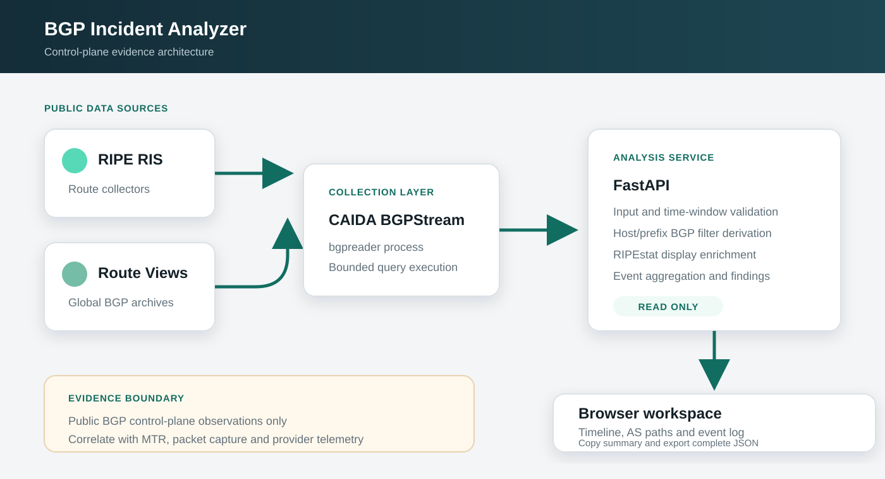
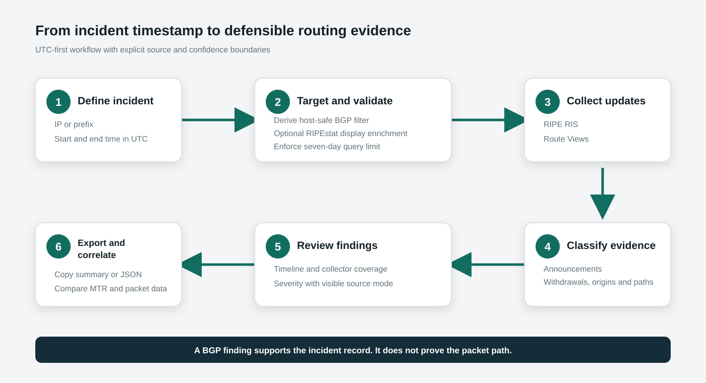

# BGP Incident Analyzer

A hardened, self-hosted proof of concept (POC) for network and security teams investigating BGP announcements, withdrawals, origin changes and AS-path visibility using CAIDA BGPStream data from RIPE RIS and Route Views.

> **Project status:** Maintained public proof of concept. The project remains in the `0.x` lifecycle and is intended for controlled evaluation, self-hosted testing and technical experimentation. It is not presented as a production-ready managed product or supported service. Docker Compose binds to loopback by default. Internet-facing deployment requires an authenticated reverse proxy, TLS, request rate limiting and normal host firewall controls.

## Objective and success criteria

The POC demonstrates how public BGP observations can be turned into a concise, repeatable incident record without requiring analysts to manually download and parse collector files.

A POC release is considered test-ready when an operator can:

- submit a valid IPv4/IPv6 address or prefix and a bounded timezone-aware incident window;
- obtain matching announcements, withdrawals, origin ASNs and AS paths from CAIDA BGPStream;
- identify whether live data or the explicit demonstration fallback produced the result;
- export a readable summary and complete JSON evidence;
- distinguish liveness from local BGPReader runtime readiness through dedicated health endpoints;
- reproduce the API tests and hardened container deployment from this repository;
- rely on enforced query timeout and event-count safety limits so a single request cannot grow without bound.

Assumptions: outbound access to RIPEstat and CAIDA data sources is available, public collectors observe the relevant route, and control-plane evidence is correlated with operational telemetry.

## POC decision checkpoint

The maintainer decision checkpoint is **31/10/2026**. By that date, the project should be explicitly moved toward one of three outcomes: define a production-readiness program toward `1.0.0`, extend the `0.x` POC with new acceptance criteria and a new checkpoint, or archive/supersede the experiment. A passing CI build alone is not sufficient justification for `1.0.0`.

## Architecture



The service validates a resource, queries CAIDA BGPStream, summarizes the returned control-plane events, and presents the evidence in a browser workspace. For a bare IP address, RIPEstat is used only to enrich the displayed current covering prefix; the BGP query itself uses a host-targeted `prefix any` filter so it still finds covering routes if RIPEstat is unavailable. For an explicit CIDR, the query uses `prefix more` so exact and more-specific updates remain visible. See the [architecture and security boundaries](docs/architecture.md).

The application image is layered on CAIDA's official BGPStream 2.3.0 container image. The Dockerfile pins its manifest digest rather than relying on a floating `latest` tag.

## Analysis workflow



The workflow keeps the incident window in UTC and preserves a visible distinction between live and demonstration data. The demonstration dataset always uses the documentation prefix `192.0.2.0/24` and is never labeled as if it were live evidence for the operator's requested resource.

## Quick start

Requirements: Docker Engine with the Compose plugin and outbound HTTPS access.

```bash
docker compose up -d --build
```

Open `http://127.0.0.1:17991`.

Docker Compose intentionally binds the service only to loopback by default. The host-side port can be changed without changing the container port:

```bash
BGP_ANALYZER_PORT=19091 docker compose up -d --build
```

To bind to a specific management IP, set `BGP_ANALYZER_BIND` explicitly. Do not bind to `0.0.0.0` on an untrusted network unless an authenticated reverse proxy and firewall policy protect the service.

The default **Live only** mode fails closed if live collection cannot run. **Auto fallback** remains available as an explicit operator choice for demonstrations or source-failure troubleshooting, and every result visibly identifies its mode and source. If Auto falls back, the result is clearly labeled with the fixed demonstration prefix rather than the requested live target.

## Runtime controls

The container accepts these bounded settings:

| Variable | Default | Allowed behavior |
| --- | ---: | --- |
| `BGP_ANALYZER_BIND` | `127.0.0.1` | Docker Compose host bind address. |
| `BGP_ANALYZER_PORT` | `17991` | Host-side TCP port. The container always listens on `17991`. |
| `BGP_ANALYZER_QUERY_TIMEOUT_SECONDS` | `90` | Live-query timeout, bounded by the application to 5-300 seconds. |
| `BGP_ANALYZER_MAX_EVENTS` | `10000` | Maximum parsed live BGP events per request, bounded to 100-100000. |

If a live query reaches the timeout or event limit, the request fails rather than returning silently truncated live evidence. Auto mode can then visibly fall back to the demonstration dataset.

## Workflow

1. Enter an IPv4/IPv6 address or CIDR prefix.
2. Select the UTC incident window, up to seven days.
3. Select RIPE RIS, Route Views, or both.
4. Run the analysis.
5. Review the finding, event distribution, observed AS paths, and raw evidence.
6. Copy the incident summary or export the complete JSON result.

A bare IP address is queried with a BGPStream `prefix any` host filter, which matches the prefixes that can affect that host. A user-supplied CIDR uses `prefix more`, which includes the normalized prefix and its more-specific updates.

## Local development

```bash
python3 -m venv .venv
source .venv/bin/activate
pip install -r requirements-dev.txt
uvicorn app.main:app --reload --port 17991
```

Without `bgpreader`, local development still supports Demonstration and Auto fallback modes. Live mode and the readiness endpoint require the CAIDA `bgpstream` package.

## API

Interactive API documentation is available at `http://127.0.0.1:17991/api/docs`.

```bash
curl -X POST http://127.0.0.1:17991/api/analyze \
  -H 'Content-Type: application/json' \
  -d '{"resource":"192.0.2.10","start":"2026-08-31T20:55:00Z","end":"2026-08-31T21:55:00Z","projects":["ris","routeviews"],"mode":"live"}'
```

Request timestamps must include a timezone. The API normalizes them to UTC and rejects unknown request fields and duplicate project selections. Results include query context so the requested resource, resolved display prefix and live BGP filter can be distinguished from the returned event prefix.

Health endpoints:

- `GET /api/health` verifies that the web application process is alive.
- `GET /api/ready` verifies that the local runtime has `bgpreader` available. It does not prove that every external collector or upstream data service is reachable.

## Operational boundaries

- This repository is a POC. Hardening, CI coverage and reproducible deployment do not make it a production-ready managed product or a substitute for independent operational validation.
- BGPStream provides public control-plane observations, not packet-path proof.
- A missing update is not proof of uninterrupted reachability.
- Withdrawal and announcement counts are observation events, not unique-peer counts and not proof of recovery ordering. Review event timestamps, peer coverage and adjacent BGP/RIB state before concluding that an outage recovered or remained unrecovered.
- Correlate findings with MTR, traceroute, packet captures, FortiGate logs, provider telemetry and ticket timestamps.
- The application does not provide built-in user authentication. Default Compose deployment is loopback-only. Shared or Internet-facing use requires an authenticated reverse proxy, TLS, request rate limiting and firewall restrictions.
- Query windows are limited to seven days. Live queries also have bounded execution time and event count.
- The parser accepts BGP announcement and withdrawal elements only. RIB and state elements are not treated as withdrawals.
- Bare-IP analysis uses a host-targeted `prefix any` BGPStream filter. RIPEstat covering-prefix data is display enrichment and is not required for the live query to target covering routes.
- Demonstration mode uses a fixed documentation dataset for `192.0.2.0/24`; it must not be interpreted as evidence for the requested resource.
- The browser table renders at most the first 500 matching events for responsiveness; the JSON export retains all events collected within the configured safety limit.
- The container runs as unprivileged UID `10001`, drops Linux capabilities, enables `no-new-privileges`, uses an init process for subprocess reaping, and is read-only except for the Compose `/tmp` tmpfs.
- Responses include restrictive browser security headers, including CSP, frame blocking, no-sniff and no-referrer policies.
- The BGPStream base image is pinned by digest. Updating that digest is an explicit dependency-maintenance change and should be validated by the container CI gate.
- `0.x` releases may change interfaces or behavior as the POC evolves. Review the changelog and validate the exact commit before relying on a new revision.

## Validation

Core local validation:

```bash
pytest -q
python -m compileall -q app tests scripts
node --check app/static/app.js
python scripts/validate_repository.py
python scripts/validate_licenses.py
```

Optional local checks matching CI:

```bash
python -m pip install ruff==0.12.8 pip-audit==2.9.0
ruff check app tests scripts
pip-audit -r requirements-dev.txt
docker compose config -q
docker build -t bgp-incident-analyzer .
```

For deployment validation, confirm that `docker compose up -d --build` completes, `GET /api/health` returns `{"status":"ok","version":"0.2.0"}`, and `GET /api/ready` returns `{"status":"ready","version":"0.2.0","bgpreader":true}`.

SVG files in `docs/images/` are the authoritative committed diagram sources. PNG renders are generated ephemerally to prove that the SVGs remain renderable and are not stored in Git:

```bash
npm ci
npm run render:diagrams
```

## CI/CD

The primary GitHub Actions workflow runs on pull requests, pushes to `main`, and manual dispatch. It uses read-only repository permissions, cancellation of superseded runs, and explicit job timeouts.

The workflow is split into four focused validation jobs:

- **Quality:** Python compilation, Ruff linting, JavaScript syntax, repository policy validation, Apache-2.0 and third-party licensing validation, and deterministic SVG renderability checks.
- **Tests:** FastAPI and analyzer tests covering strict API validation, host/prefix filter semantics, RIPEstat fallback, demo isolation, BGPReader parsing, state/RIB rejection, event-limit handling, timeout cleanup, severity classification, and timeline aggregation.
- **Container:** Compose validation, Docker build, non-root UID verification, embedded licensing-material verification, local BGPReader readiness, liveness, API documentation and security-header smoke checks on port `17991`.
- **Security:** dependency vulnerability auditing with `pip-audit` against the exactly pinned runtime and development Python requirements.

CI validates the source and the self-hosted POC container candidate. Publishing a tagged POC release or pre-built container image remains an explicit release action rather than an automatic side effect of every merge.

## Maintenance

This project is maintained as a public, self-hosted proof of concept. The `0.x` lifecycle is intentionally pre-1.0 and may evolve as the design is validated. There is no production support or SLA implied by the repository. Use GitHub Issues for reproducible defects and bounded enhancement proposals. Report suspected security vulnerabilities using the private process in [SECURITY.md](SECURITY.md).

Dependency updates are managed through Dependabot for Python and npm. Material changes should use a branch and pull request and must preserve the distinction between live evidence and demonstration data.

The POC must be reassessed at the decision checkpoint above before any `1.0.0` designation.

## License

BGP Incident Analyzer's first-party source code and documentation are licensed under the **Apache License 2.0**. See [LICENSE](LICENSE) for the complete license terms.

Third-party software is not relicensed under Apache-2.0. Attribution and direct dependency licensing information are documented in [THIRD_PARTY_NOTICES.md](THIRD_PARTY_NOTICES.md), with the CAIDA BGPStream BSD notice retained at [LICENSES/CAIDA-BGPStream-BSD-2-Clause.txt](LICENSES/CAIDA-BGPStream-BSD-2-Clause.txt). The repository also includes [NOTICE](NOTICE) so required attribution remains visible in redistributions.

The Dockerfile copies the repository's licensing materials into `/usr/share/licenses/bgp-incident-analyzer/` in the built image. See [docs/licensing.md](docs/licensing.md) for contribution terms, third-party boundaries, and the additional license-audit gate required before publishing pre-built binary or container artifacts.
