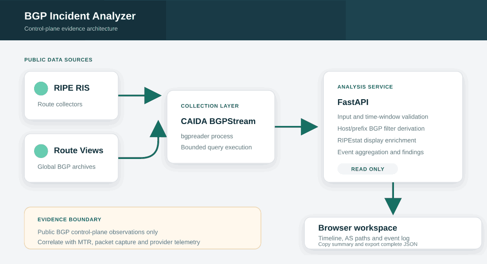

# Architecture

## System boundary

BGP Incident Analyzer is a read-only analysis service. It queries public BGP control-plane observations and does not connect to routers, FortiGate devices, customer environments, or routing sessions.

[Open the scalable SVG version](images/architecture.svg)

## Components

| Component | Responsibility | Trust boundary |
| --- | --- | --- |
| Browser workspace | Collect query parameters and render evidence | Treat all displayed data as untrusted text |
| FastAPI service | Validate requests, derive safe BGP filters, enforce query bounds, orchestrate collection and summarize events | Trusted application process |
| RIPEstat | Enrich a bare IP with its current covering prefix for display and context | External public API; not required for host-targeted BGP filtering |
| CAIDA BGPStream | Retrieve RIPE RIS and Route Views update records through `bgpreader` | External public data source and subprocess |
| Demo dataset | Keep the interface testable when live collection is unavailable | Fixed documentation prefix and private-use ASNs; never live evidence for the requested resource |

## Resource targeting

Resource targeting is deliberately separated from display enrichment:

- A bare IPv4/IPv6 address is normalized to `/32` or `/128` and queried through a BGPStream `prefix any` filter. For a host prefix, this captures relevant covering prefixes without broadening the query to unrelated more-specifics of a larger aggregate.
- RIPEstat Network Info may enrich that host with its current covering prefix for display. A RIPEstat failure does not prevent the BGPStream host-targeted query.
- A user-supplied CIDR is normalized and queried through `prefix more`, preserving exact-prefix and more-specific update visibility.
- Returned API query context distinguishes the requested resource, display prefix and live BGP filter.

This avoids treating a bare address as an exact `/32` or `/128` BGP route, while also avoiding reliance on a present-day RIPEstat prefix to define a historical query target.

## Analysis workflow

[Open the scalable SVG version](images/analysis-flow.svg)

## Runtime and failure boundaries

- `GET /api/health` is a liveness check for the FastAPI process.
- `GET /api/ready` verifies that the local runtime has `bgpreader` available. It does not prove external collector reachability.
- Live queries are limited to a seven-day request window, a bounded execution timeout, and a bounded parsed-event count.
- Timeout, event-limit abort, or request cancellation terminates and reaps the `bgpreader` subprocess rather than allowing orphaned work to continue.
- Only BGP announcement (`A`) and withdrawal (`W`) elements are accepted for analysis. RIB and state elements are ignored rather than being classified as withdrawals.
- Auto mode may visibly fall back to the fixed demonstration dataset when the live source is unavailable. Live-only mode returns an error instead.
- Demo mode and Auto fallback always report the demo prefix `192.0.2.0/24`, so demonstration evidence cannot masquerade as observations for the requested live target.
- Mixed announcement/withdrawal findings are chronology-neutral. Event counts are not described as unique-peer counts or proof that recovery occurred.

## Security boundary

- Docker Compose binds the application to `127.0.0.1` by default. Binding to another address is an explicit deployment decision.
- The application has no built-in user authentication. Shared or Internet-facing access requires an authenticated reverse proxy, TLS, request rate limiting, and firewall restrictions.
- The container runs as UID `10001`, drops all Linux capabilities, enables `no-new-privileges`, uses a read-only root filesystem, and receives only a temporary `/tmp` filesystem.
- Browser responses apply a restrictive Content Security Policy, frame blocking, MIME sniffing protection, no-referrer behavior, and a restrictive permissions policy.
- Outbound network access is required for RIPEstat enrichment and CAIDA BGPStream data sources and should be restricted at the deployment layer where practical.
- Query results are operational control-plane evidence, not authoritative proof of packet forwarding.
- No customer identifiers, credentials, private configurations, or production logs are stored in this repository.

## Deployment responsibilities

The repository provides a hardened self-hosted POC container, but it does not provide a complete Internet edge. Operators exposing the service beyond localhost or a trusted management network remain responsible for identity, TLS certificate lifecycle, reverse-proxy configuration, rate limiting, centralized logging, host patching, monitoring, backup of exported evidence if required, and incident-response procedures.
